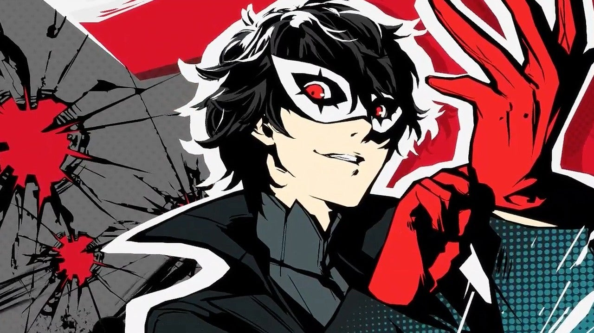
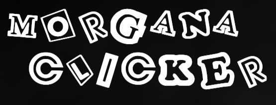
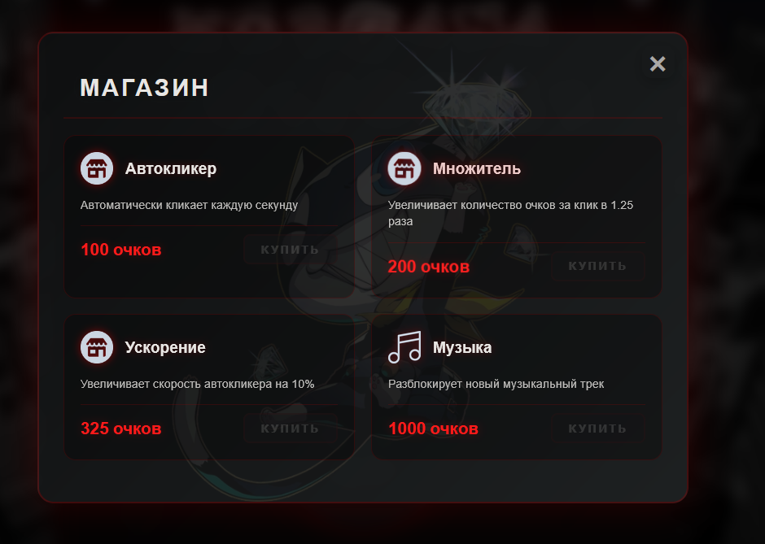

# Кликер-игра "Morgana"

## Описание проекта

"Morgana" — это увлекательная кликер-игра, разработанная с любовью и вниманием к деталям. В этой игре вы будете набирать очки с каждым кликом, открывая новые уровни и бонусы. Проект реализован как интерактивный сайт, доступный через GitHub Pages.

## Особенности

- **Интуитивный геймплей:** Легко понять, быстро начать играть.
- **Улучшения и бонусы:** Прокачивайте свои возможности с каждым новым уровнем.
- **Современный дизайн:** Приятный интерфейс и плавная анимация.
- **Доступность:** Играйте онлайн без необходимости установки.

## Как играть

- **Нажимайте на кнопку:** Каждый клик приносит вам новые очки.
- **Собирайте бонусы:** Разблокируйте улучшения и дополнительные возможности.
- **Соревнуйтесь:** Сравнивайте свои результаты с друзьями и стремитесь к лидерству.

## Скриншоты

## Демо

Посетите [живую демо-версию](https://fieix.github.io/Morgana.github.io/) проекта и начните играть прямо сейчас!

## Используемые технологии

- **Языки:** HTML, CSS, JavaScript
- **Хостинг:** GitHub Pages

## Отказ от коммерческой цели

Этот проект не предназначен для коммерческого использования и создан исключительно в учебных целях.

## Вклад в проект

Мы всегда рады улучшениям! Если у вас есть идеи или предложения, вы можете:
- Создать [форк репозитория](https://github.com/Fieix/Morgana.github.io/fork)
- Открыть issue для обсуждения улучшений
- Отправить pull request с вашими изменениями

## Лицензия

Проект распространяется под [лицензией MIT](LICENSE).

## Контакты

Если у вас возникли вопросы или предложения, вы можете связаться с нами:
- **GitHub:** [Fieix](https://github.com/Fieix)
